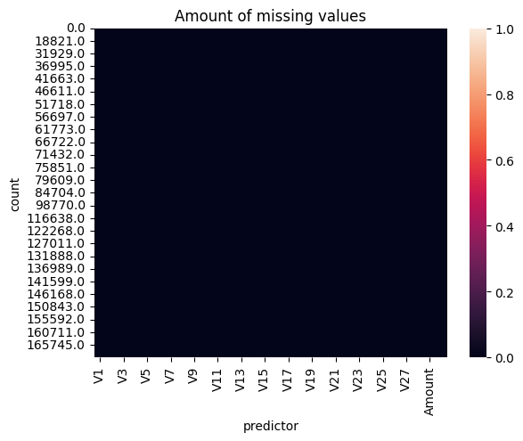
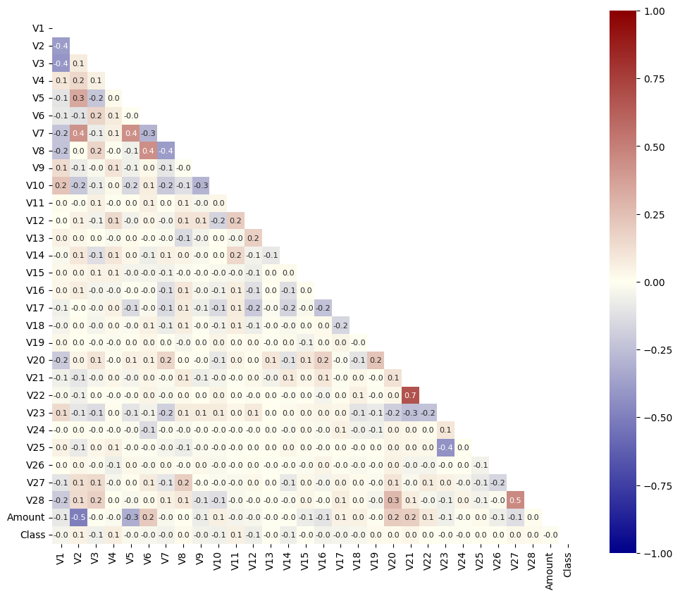
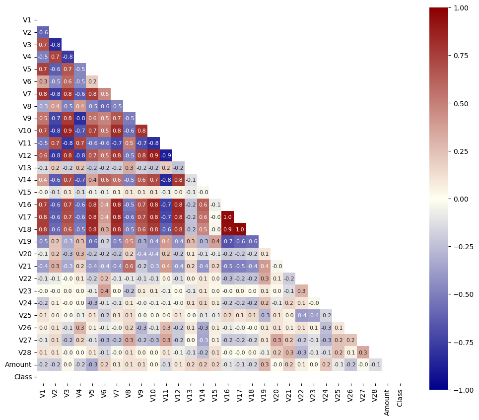
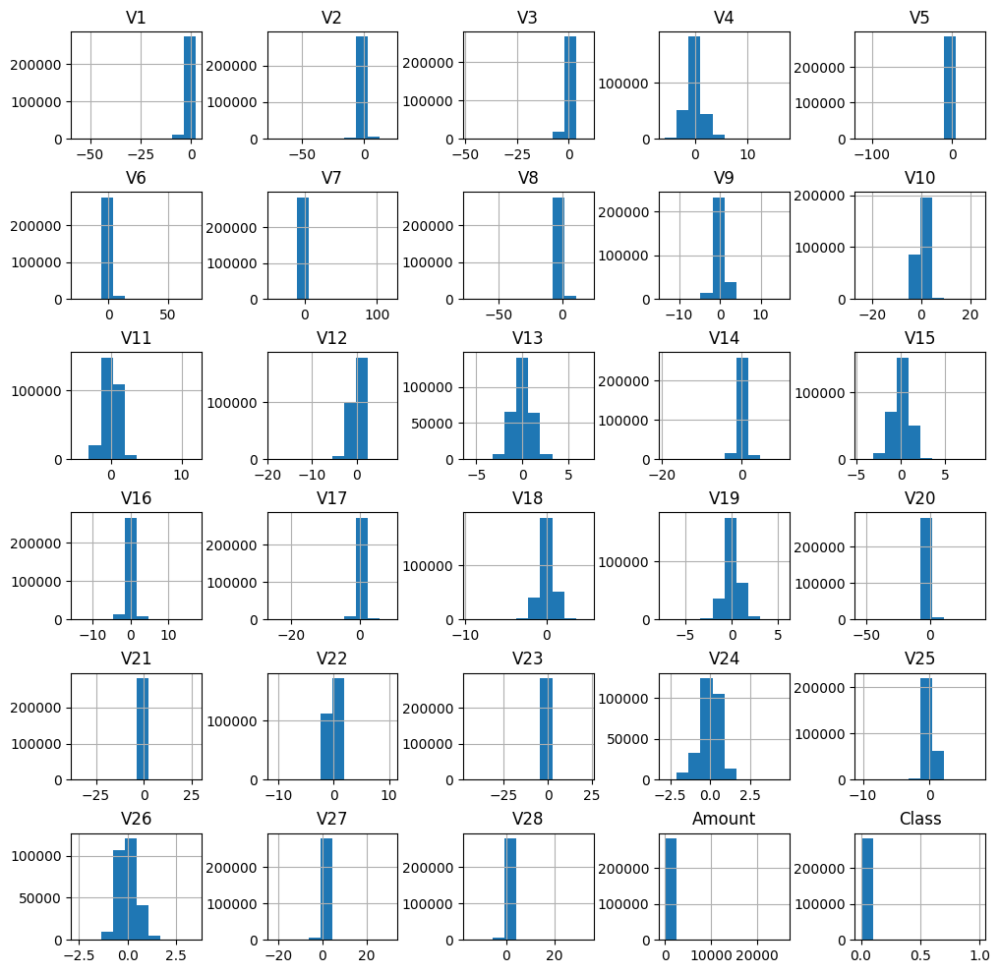

# Credit_fraud
Credit card fraud prediction model.

This is my take on the Kaggle [Credit Card Fraud Detection](https://www.kaggle.com/datasets/mlg-ulb/creditcardfraud) competition. 
 

## Aim

The aim of the competitioon is to build a model for reliable detection of fraudulent credit card transactions. 

## Exploratory data analysis

First, we will look at the **assumptions of a logistic regression model**: 

- Adequate sample size 
- Binary outcome
- No missing data
- Indepent residuals
- (No multicolinearity between the predictors)
- (No outliers)

Let us address each of the assumptions.
### Adequate sample size (at least ten cases per predictor)
 The data set provided consist of 29 independent variables and a binary dependent variable 'Class', with >284 000 obeservations. 
 It has been proposed that a data set should have at least ten cases per predictor [1]. However, the validity of this rule has been questioned. [2]   
*Note: the terms 'independent variable' and 'predictor' will be used interchangable*

### Binary outcome
The dependent variable 'Class' has two factors: 0 (non-fraudulent) and 1 (fraudulent). 
However, with a ratio of ca. 578:1 the non-fraudulent cases far outweigh the fraudulent cases we want to predict. This will pose a challenge for our logistic regression model to precisely predict faud. 
We will address this during modeling.

### Missing data
There are no missing values in the data. 

  

### Multicollinearity
While not necessarily an assumption, multicollinearity can influence the interpretability of the model.  
The correlation matrix of all predictors and the outcome variable as-is shows minimal correlations, with the exception of V21/V22. Strikingly, none of the independent variables seems to be a good predictor of outcome.  
*Note that non-linear relationships are not captured by the correlation matrix*
 

  

 
Since the dependent variable is undersampled, let us look a the correlation matrix when we consider only fraud cases.
  

  

*Note: There are no correlation values for 'Class' as correlation is based on the standard deviation, which is non-existent after filtering 'Class' for one value.*

Considerations for further analysis:
- VIF
- Regularization
- 
<!-- 
 -->

### Outliers
While logistic regression is more robust against ourliers than linear regression, outliers can still influence the estimates.

### Other observations

The predictors 

## Feature engineering

The predictors are not distributed equally and

  

 - Quantile normalisation

## Model building
- models: log reg, glm, tree, RF
- Initial model
- Regularization, PCA
- Hyperparameter tuning
- which metrics?
- table with summed results

## References
[1] [A simulation study of the number of events per variable in logistic regression analysis](https://pubmed.ncbi.nlm.nih.gov/8970487/)
[2] [Relaxing the rule of ten events per variable in logistic and Cox regression](https://pubmed.ncbi.nlm.nih.gov/17182981/)